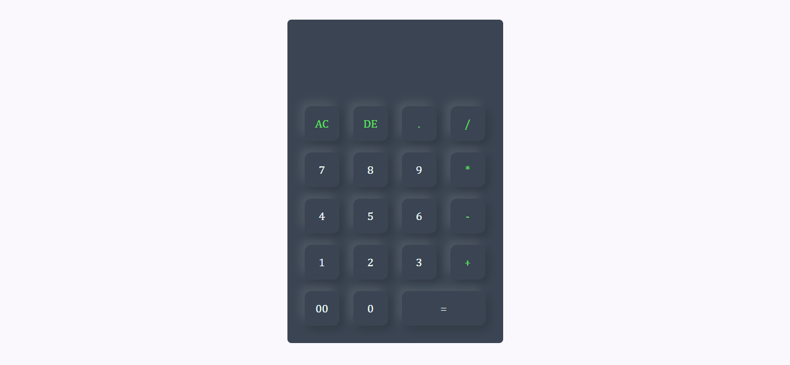

# 🧮 NumVyne

## 📸 App Preview

Here’s how your quiz looks in action:

> 

---

# Web Calculator

A sleek, responsive web-based calculator built with HTML, CSS, and JavaScript. This calculator provides basic arithmetic operations with a clean, modern interface.

---

## 🎥 Demo Video

▶️ [Watch the Demo](https://siddhantshukla108.github.io/Calculator/)

---

## 🚀 Features

- **Basic Operations**: Addition, subtraction, multiplication, and division
- **Clear Functionality**: All Clear (AC) and Delete (DE) buttons
- **Decimal Support**: Ability to perform calculations with decimal numbers
- **Responsive Design**: Works on both desktop and mobile devices
- **Modern UI**: Attractive color scheme with visual feedback on button presses

---

## 🛠️ Tech Stack

- **HTML5**: For the calculator structure
- **CSS3**: For styling and responsive design
- **JavaScript**: For calculator functionality and user interactions

---

## Getting Started

### Prerequisites

All you need is a modern web browser:
- Chrome, Firefox, Safari, Edge, or any other modern browser

--- 

### Installation

1. Clone or download this repository
2. Navigate to the project directory
3. Open `index.html` in your web browser

Alternatively, you can simply copy the HTML and CSS code into files and run them locally.

---

## Usage

1. Click on number buttons to input values
2. Use operator buttons (+, -, *, /) to select operations
3. Press the equals (=) button to calculate the result
4. Use AC (All Clear) to reset the calculator
5. Use DE (Delete) to remove the last entered character

---

## 📁 Folder Structure

/project-root  
│  
├── index.html # Main HTML file  
├── style.css # Styling for layout and UI  
└── /images  
└── Logo.jpg # Logo used in the app  

---

## Code Overview

### HTML Structure
The calculator is built with a form containing:
- A display input field
- Buttons for numbers (0-9), operators (+, -, *, /), and functions (AC, DE, =)

--- 

### CSS Styling
- Modern dark theme with #3a4452 as the primary color
- Button hover effects with shadowing
- Responsive design that works on various screen sizes
- Distinct colors for operators and special functions

---

### JavaScript functionality
- Uses inline event handlers for simplicity
- `eval()` function to calculate expressions (note: for production, consider a safer alternative)
- Basic string manipulation for the delete function

---

## Customization

You can easily customize the calculator by:
1. Changing color scheme in the CSS
2. Modifying the button layout in HTML
3. Adding new functions in JavaScript

---

## Browser Compatibility

This calculator works on all modern browsers that support:
- ES6 JavaScript features
- CSS3 box-shadow and flexbox properties

---

## Limitations

- Currently uses `eval()` which has security implications (not recommended for production)
- Does not support keyboard input
- Limited to basic arithmetic operations

---

## Future Enhancements

Potential improvements for this calculator:
- [ ] Replace `eval()` with a safer calculation method
- [ ] Add keyboard support
- [ ] Implement scientific calculator functions
- [ ] Add calculation history
- [ ] Include theme switcher

---

## 🤝 Contribution Guidelines
- Fork the repo
- Create a new branch (`feature-xyz`)
- Commit changes
- Submit a PR 🚀

---

## 📞 Contact Me

📧 **Email:** shuklasiddhant365@gmail.com  
💼 **LinkedIn:** [siddhant-shukla108](https://www.linkedin.com/in/siddhant-shukla108/)  
🐦 **Twitter:** [siddhant_shuk1a](https://x.com/siddhant_shuk1a)  
🌍 **Portfolio:** [siddhantshukla-portfolio](https://siddhantshukla-portfolio.netlify.app/)

---

> ⭐ Don’t forget to star the repo if you like it!  
> 🤝 Contributions, issues, and suggestions are welcome!
